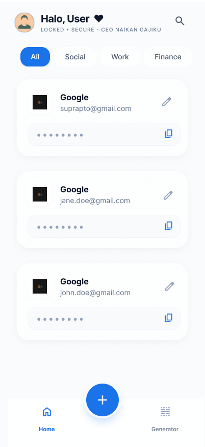

# AI Coding Assistant Instructions for pass_manager

## Project Overview
**pass_manager** is an early-stage Flutter password management application targeting mobile, web, and desktop platforms. The codebase follows Clean Architecture principles with minimal implementation completed.

## UI/UX Design Reference

Use these mockups as the visual specification when implementing pages:

| Landing Page | Add New Password |
|:---:|:---:|
|  |  |

| Password Detail | Password Generator |
|:---:|:---:|
|  |  |

### Page-to-File Mapping
| Design | Implementation File |
|--------|---------------------|
| Landing Page | `lib/presentation/pages/home_page.dart` |
| Add New Password | `lib/presentation/pages/add_password_page.dart` |
| Password Detail | `lib/presentation/pages/password_detail_page.dart` |
| Password Generator | `lib/presentation/pages/generator_page.dart` |

### Design Guidelines
- Follow the exact layout, spacing, and component hierarchy shown in mockups
- Use `AppColors` constants from `lib/core/constants/app_colors.dart` for all colors
- Maintain consistent padding (typically 16-24px edge margins)
- Use rounded corners on cards and buttons as shown in designs

## Architecture Pattern: Clean Architecture (Dart/Flutter)

### Layer Structure
```
lib/
├── core/           # Shared utilities, constants
├── domain/         # Business logic, entities, abstract repositories (highest level)
├── data/           # Data sources, models, repository implementations (lowest level)
└── presentation/   # UI pages, viewmodels (Flutter-specific layer)
```

### Layer Responsibilities & Communication Flow

1. **Presentation Layer** (`lib/presentation/`)
   - Contains `pages/` (UI screens) and `viewmodels/` (state management, business logic delegation)
   - **Should NOT** import from `data/` directly—only through domain repositories
   - ViewModels call repository methods from `domain/repositories/` to fetch/persist data
   - Example: `password_viewmodel.dart` manages password UI state

2. **Domain Layer** (`lib/domain/`)
   - `entities/`: Pure data objects defining business concepts (e.g., `PasswordEntity`)
   - `repositories/`: Abstract repository interfaces—the contract between layers
   - **Must be independent** of Flutter, databases, or HTTP libraries—pure Dart only
   - Never import from `data/` or `presentation/`

3. **Data Layer** (`lib/data/`)
   - `datasources/`: Concrete data sources (local database, APIs)
   - `models/`: DTOs that mirror domain entities but include serialization logic
   - `repositories/`: Implementations of domain repository interfaces
   - Transforms models ↔ entities using mappers (often implicit in implementation)

4. **Core Layer** (`lib/core/`)
   - `constants/app_colors.dart`: Centralized theme colors (primary blue: `0xFF1164E8`, danger red: `0xFFF43F5E`)
   - Future home for utilities, error handling, logging

### Data Flow Example (Fetching Passwords)
```
HomePage → PasswordViewModel → PasswordRepository (domain, abstract)
    ↓ calls repository method
PasswordRepositoryImpl (data, concrete) → DatabaseDatasource
    ↓ queries
SQLite/Local Database
    ↓ returns PasswordModel
PasswordRepositoryImpl converts model → PasswordEntity
    ↓
PasswordViewModel updates state
    ↓
HomePage rebuilds
```

## Current Project State

- **Mostly scaffolded**: Core architecture folders exist but most files are empty placeholders
- **Implemented**: `app_colors.dart` with project color constants
- **In progress**: Database layer structure (`database.dart` datasource is a stub)
- **Pages ready**: File structure exists for `add_password_page`, `generator_page`, `home_page`, `password_detail_page`

## Key Conventions & Patterns

### Naming & File Organization
- Entity files: `password_entity.dart` (not `password.dart`)
- Model files: `password_model.dart` (includes serialization methods like `toJson()`, `fromJson()`)
- Repository abstract: `password_repository.dart` (interface in domain)
- Repository concrete: `password_repository_impl.dart` (implementation in data)
- ViewModels: `password_viewmodel.dart` (delegates to repositories, exposes state via getters/streams)

### Repository Pattern
```dart
// domain/repositories/password_repository.dart (abstract)
abstract class PasswordRepository {
  Future<List<PasswordEntity>> getAll();
  Future<void> add(PasswordEntity entity);
  Future<void> delete(String id);
}

// data/repositories/password_repository_impl.dart (concrete)
class PasswordRepositoryImpl implements PasswordRepository {
  final PasswordDatasource _datasource;
  
  @override
  Future<List<PasswordEntity>> getAll() async {
    final models = await _datasource.fetchAll();
    return models.map((m) => m.toEntity()).toList();
  }
  // ...
}
```

### Model-to-Entity Conversion Pattern
- Models include serialization: `PasswordModel.fromJson()`, `toJson()`
- Models include domain conversion: `PasswordModel.toEntity()` → `PasswordEntity`
- Entities are immutable, models are data transfer objects only

### ViewModel Pattern (State Management)
- ViewModels hold business logic and state
- Expose state via properties or streams (e.g., `notifyListeners()` if using ChangeNotifier)
- Never directly update state from UI—delegate through ViewModel methods
- Example: `PasswordViewModel` manages password list, filtering, deletion

## Build & Development Workflow

### Flutter Commands
- **Run development build**: `flutter run`
- **Build for production**: `flutter build apk` (Android), `flutter build ios` (iOS), `flutter build web`
- **Format code**: `dart format lib/` (applies Dart style guide)
- **Analyze for issues**: `flutter analyze` (uses `analysis_options.yaml` rules)
- **Resolve dependencies**: `flutter pub get`

### Linting & Code Quality
- **Active linter set**: `package:flutter_lints` (configured in `analysis_options.yaml`)
- **Lint violations**: Visible in IDE; also caught by `flutter analyze`
- Common rules: avoid print in production code, prefer const constructors, handle null safely

### Testing
- Unit tests: `test/` folder
- Widget tests: Use `flutter_test` SDK
- Command: `flutter test`

## External Dependencies
**Current**: Minimal (`flutter`, `cupertino_icons`)  
**Likely future additions**:
- **State management**: `provider`, `riverpod`, or `getx`
- **Database**: `sqflite` (local SQLite), `drift` (type-safe wrapper)
- **API calls**: `dio`, `http`, or `shelf` (backend)
- **Serialization**: `json_serializable`, `freezed`

## Color Palette Reference
Defined in [lib/core/constants/app_colors.dart](lib/core/constants/app_colors.dart):
- **Primary Blue** (`#1164E8`): Buttons, icons, accent elements
- **Background** (`#F5F7FA`): Light gray, page background
- **Text Dark** (`#2D3B48`): Primary text color
- **Text Grey** (`#9EA6B5`): Secondary/hint text
- **Danger Red** (`#F43F5E`): Delete buttons, error states

## Common Patterns: What to Avoid
- ❌ Import `data/` classes directly in `presentation/` (breaks separation)
- ❌ Put Firebase/HTTP logic in `domain/` (domain must remain framework-agnostic)
- ❌ Hardcoded colors instead of `AppColors.*` constants
- ❌ Stateful widgets for complex state—use ViewModels instead
- ❌ Mix entity and model classes (entities = domain, models = data layer only)

## Getting Started: Implementing a New Feature

1. **Define domain**: Create `lib/domain/entities/feature_entity.dart` and `lib/domain/repositories/feature_repository.dart` (abstract)
2. **Create data layer**: Implement repository in `lib/data/repositories/feature_repository_impl.dart`, add models in `lib/data/models/feature_model.dart`
3. **Build presentation**: Add `lib/presentation/viewmodels/feature_viewmodel.dart`, then UI pages in `lib/presentation/pages/`
4. **Wire up**: Ensure repository is instantiated and injected into ViewModel (manual DI for now, or add `get_it` later)
5. **Test**: Write unit tests for entities, repository implementations, and ViewModel logic

## Multi-Platform Targets
Project is configured for:
- **Android** (`android/`)
- **iOS** (`ios/`)

Avoid platform-specific code in `lib/`; use platform channels only if necessary (e.g., for native encryption).
